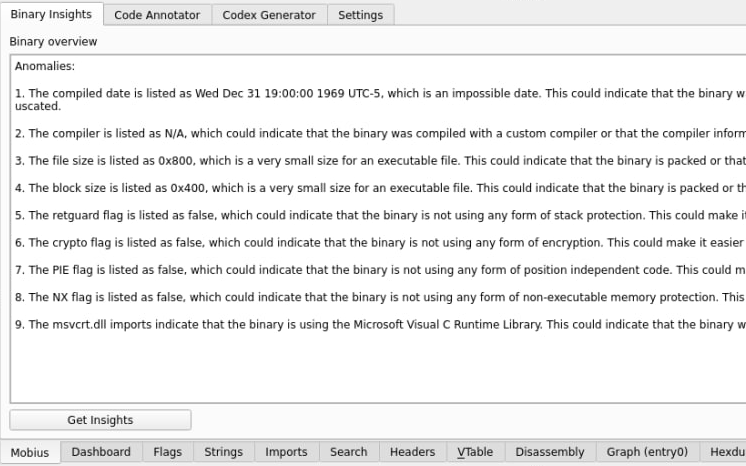
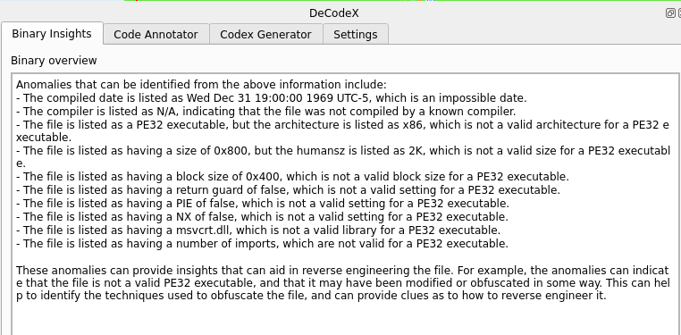
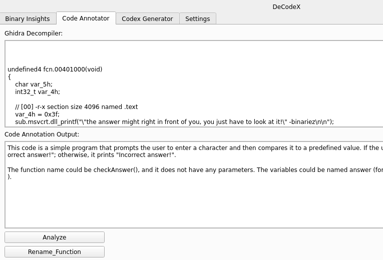
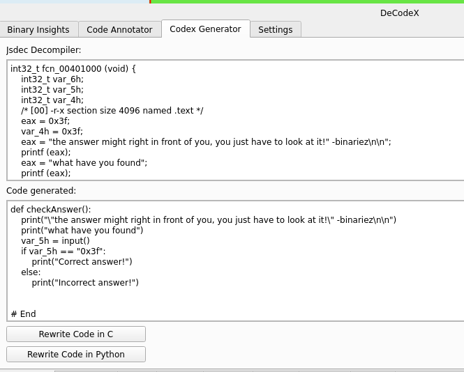
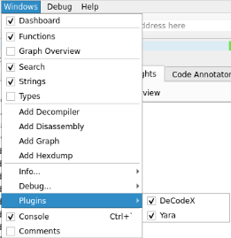
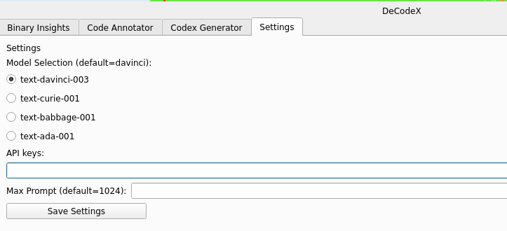

# cutter-DeCodeX

This is a plugin for Cutter, that integrates OpenAI to provide insights that is useful in reverse engineering. 
offers code annotation and spots anomalies in basic static information of the binary.

### Binary Insights (looks for anomaly) 





### Code Annotator




### Code refactoring and rewriting in Python




## Requirements
- Linux Distro 
- Cutter plugin App Image
- API keys from OPENAI 

## Usage
1. Download and place DeCodeX.py Cutter plugin in directory ``~/.local/share/rizin/cutter/plugins/python/``

```
cd ~/.local/share/rizin/cutter/plugins/python/ && wget https://raw.githubusercontent.com/aj-tap/cutter-DeCodeX/main/DeCodeX.py 
```

2. Enable the plugin

 

3. Input the API keys and set the max prompt tokens to settings tab and click the saved settings button.


 
